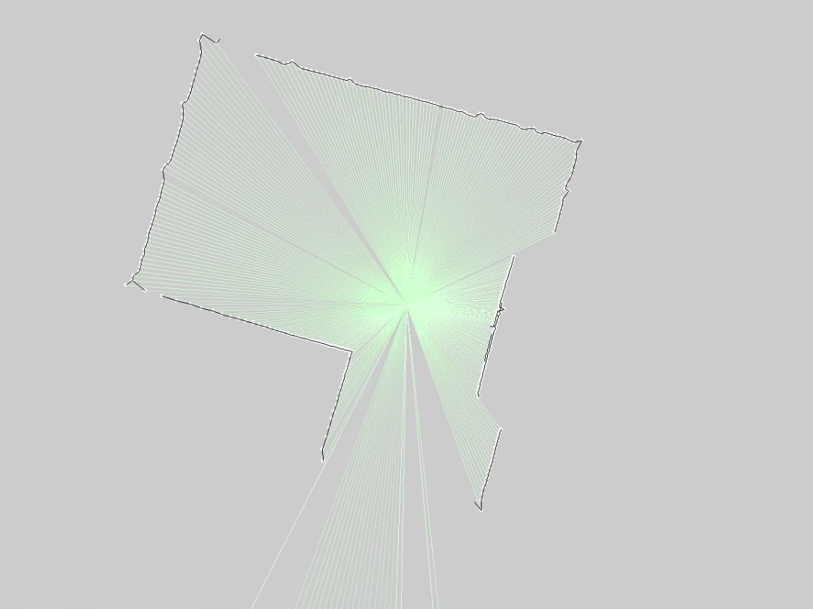

# lidar_reader

Personal project: read a salvage Neato XV-11 lidar on a SunFounder PiCar-X
(Raspberry Pi / Ubuntu) and draw a live 360° scan.

This repo is the **scan path I wrote by hand in Mojo** — serial parse, RPM
feedback for the turret-motor PWM script, and a pygame scope-style display
of range and intensity. It is not the whole robot stack.

## Hardware
- XV-11 lidar turret mounted on the PiCar-X
- Turret motor powered from Robot HAT PWM through a small discrete circuit
  (transistor, resistor, Schottky diode)
- Scan data into the Robot HAT UART

## What this repo contains
- `picar_lidar/reader.mojo` — serial read and parse
- `picar_lidar/viewing.mojo` — live plot
- `picar_lidar/data.mojo`, `strings.mojo`
- `lidar_serial_16k.bin` — sample capture so the display can run without the sensor

## Not in this repo
ROS 2 nodes (keyboard teleop, camera) run in Docker on the Pi and live
elsewhere on the machine. No SLAM or autonomy yet.

## Run

With real device data from the lidar turret:

    pixi run mojo picar_lidar/reader.mojo /dev/serial0

With test data:

    pixi run mojo picar_lidar/reader.mojo lidar_serial_16k.bin

## Status
Works on the robot for live scans. Next: publish scans into ROS 2 and try SLAM.
